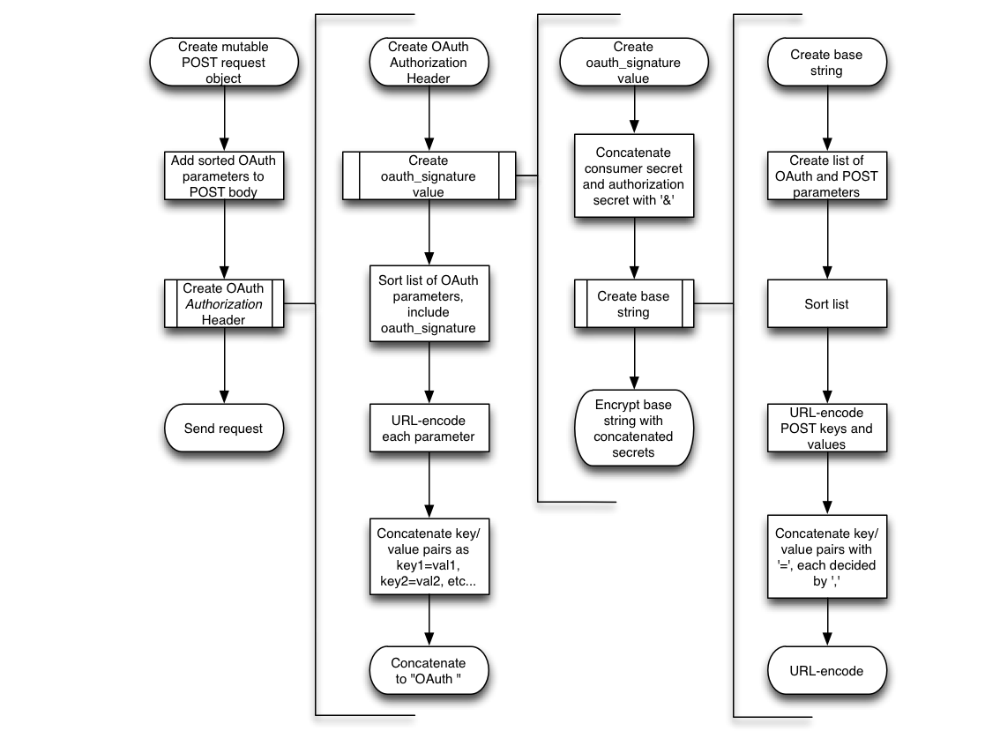

# 500px API Tutorial

Hello astronauts, war heroes, Olympians - you're here because we want the best, and you are it. So: Who is ready to make some great apps?

## Specifics

500px API requests are RESTful and return JSON. **All** 500px API requests are conducted over HTTPS. There are two ways to sign requests: Consumer Key and OAuth. Consumer Key-signed requests are ones that aren't specific to a logged-in user. For instance, getting a list of popular photos only requires the Consumer Key authentication. However, favouriting a photo requires a user to be logged in; these types of requests must be signed with OAuth.

There are some requests which can be signed with either a Consumer Key or OAuth. In these cases, additional information is returned if the request is signed with OAuth. This information is specific to the currently logged-in user; for example, whether or not a user has favourited a photo or is following a specific user.

## Signing Requests with your Consumer Key

To sign a request with your consumer key, all you have to do append `consumer_key=YOUR_CONSUMER_KEY_HERE` to the query string of the request. So a request to look at the second page of editor's choice would look `https://api.500px.com/v1/photos?feature=editors&page=2&consumer_key=YOUR_CONSUMER_KEY_HERE`. 

## Signing Requests with OAuth

Signing requests with OAuth is, unsurprisingly, more complicated. First off, you'll need to authenticate your user.

### Three-Legged OAuth Authentication

The three-legged OAuth authentication with the 500px API is straightforward and uses standard OAuth workflow. Any one of available libraries for your platform should work. If you want to roll your own, the instructions below on two-legged OAuth should get you going.

### Two-Legged OAuth Authentication

Two-legged OAuth authentication, sometimes referred to as XAuth, is also possible if we enabled it on your account. Just ask nicely :) 

1.	### Obtain a request token.
	
	Make a POST request to `https://api.500px.com/v1/oauth/request_token`. Set the HTTP header "Authorization" to the same URL. You should receive back a 200 response code and a string like the following. 
	>	oauth_token=TOKEN_HERE&oauth_token_secret=SECRET_HERE&oauth_callback_confirmed=true
	Extract these out for the next step.

2.	### Obtain Access Token
	
	Make a POST request to `https://api.500px.com/v1/oauth/access_token`. You'll need to set the POST body to be a querey string containing `x_auth_mode` set to "client_auth" and `x_auth_password` and `x_auth_username` set to URL-encoded username and password with which you're trying to authenticate. These keys/value pairs must be lexicographically sorted by key name. In Objective-C, this looks something like the following:
	
		NSArray * parameterArray = [NSArray arrayWithObjects:
			[NSString stringWithFormat:@"%@=%@", @"x_auth_mode", @"client_auth"],
			[NSString stringWithFormat:@"%@=%@", @"x_auth_password", [thePassword urlEncode]],
			[NSString stringWithFormat:@"%@=%@", @"x_auth_username", [theUserName urlEncode]], nil];
		[postRequest setHTTPBody:[[parameterArray componentsJoinedByString:@"&"] dataUsingEncoding:NSUTF8StringEncoding]];
			
	This is the easy part. Now we need to set the `Authorization` HTTP header. We use the `oauth_nonce`, `oauth_signature_method`, `oauth_timestamp`, `oauth_consumer_key`, `oauth_token`, `oauth_signature`, and `oauth_version` parameters to construct the OAuth `Authorization` field value. The order of these is again **very important** since they are lexicographically sorted by key name. In Objective-C, it is constructed as follows:
	
		NSArray * keysAndValues = [NSArray arrayWithObjects:
	                               [NSString stringWithFormat:@"%@=\"%@\"", @"oauth_nonce", [self.nonce urlEncode]],
	                               [NSString stringWithFormat:@"%@=\"%@\"", @"oauth_signature_method", [@"HMAC-SHA1" urlEncode]],
	                               [NSString stringWithFormat:@"%@=\"%@\"", @"oauth_timestamp", [self.timestamp urlEncode]],
	                               [NSString stringWithFormat:@"%@=\"%@\"", @"oauth_consumer_key", [kConsumerKey urlEncode]],
	                               [NSString stringWithFormat:@"%@=\"%@\"", @"oauth_token", [theRequestToken urlEncode]],
	                               [NSString stringWithFormat:@"%@=\"%@\"", @"oauth_signature", [SIGNATURE_HERE urlEncode]],
	                               [NSString stringWithFormat:@"%@=\"%@\"", @"oauth_version", [[NSString stringWithString:@"1.0"] urlEncode]],
	                               nil];
	    
	    [postRequest addValue:[NSString stringWithFormat:@"OAuth %@", [keysAndValues componentsJoinedByString:@", "] forHTTPHeaderField:@"Authorization"];
	    
	One of the key/value pairs we use here is the signature used by OAuth. *This uses a different base string than the one used to sign normal OAuth requests*. This special base string is constructed and then encrypted using HMAC-SHA1. 
	
	Append your request secret to you Consumer Secret, separated by an apersand, and encode it with UTF8. Construct your base string (see below) and encode it with UTF8 as well, and then generate the signature. In Objective-C, a method to generate this might look like the following:
	
		NSString * secret = [NSString stringWithFormat:@"%@&%@", YOUR_CONSUMER_KEY_HERE, theRequestSecret];
    
	    NSData * secretData = [secret dataUsingEncoding:NSUTF8StringEncoding];
	    NSData * baseData = [BASE_STRING_HERE dataUsingEncoding:NSUTF8StringEncoding];
	    
	    uint8_t digest[20] = {0};
	    CCHmac(kCCHmacAlgSHA1, secretData.bytes, secretData.length,
	           baseData.bytes, baseData.length, digest);
	    
	    NSData * signatureData = [NSData dataWithBytes:digest length:20];
	    return [signatureData base64EncodedString];
	    
	Lastly, we'll need to construct the base string used to create the signature. This is farily straightforward but is a little quirky. Constructing the base string in Objective-C would look like the following:
	
		NSString * url = [theURL urlEncode]; //this is the URL we're calling, should be https://api.500px.com/v1/oauth/access_token
	    
	    NSString * parameters;
	    
	    NSString * oauth_consumer_key = [YOUR_CONSUMER_KEY urlEncode];
	    NSString * oauth_nonce = [self.nonce urlEncode];
	    NSString * oauth_signature_method = [[NSString stringWithString:@"HMAC-SHA1"] urlEncode];
	    NSString * oauth_timestamp = [self.timestamp urlEncode];
	    NSString * oauth_version = [[NSString stringWithString:@"1.0"] urlEncode];
	    NSString * x_auth_mode = [@"client_auth" urlEncode];
	    NSString * x_auth_password = [[thePassword urlEncode] urlEncode]; //These are double-encoded on purpose
	    NSString * x_auth_username = [[theUserName urlEncode] urlEncode];
	    
	    NSArray * params = [NSArray arrayWithObjects:
	                        [NSString stringWithFormat:@"%@%%3D%@", @"oauth_consumer_key", oauth_consumer_key],
	                        [NSString stringWithFormat:@"%@%%3D%@", @"oauth_nonce", oauth_nonce],
	                        [NSString stringWithFormat:@"%@%%3D%@", @"oauth_signature_method", oauth_signature_method],
	                        [NSString stringWithFormat:@"%@%%3D%@", @"oauth_timestamp", oauth_timestamp],
	                        [NSString stringWithFormat:@"%@%%3D%@", @"oauth_token", theRequestToken],
	                        [NSString stringWithFormat:@"%@%%3D%@", @"oauth_version", oauth_version],
	                        nil];
		
	    params = [params arrayByAddingObjectsFromArray:[NSArray arrayWithObjects:[NSString stringWithFormat:@"%@%%3D%@", @"x_auth_mode", x_auth_mode],
	    	[NSString stringWithFormat:@"%@%%3D%@", @"x_auth_password", x_auth_password],
	    	[NSString stringWithFormat:@"%@%%3D%@", @"x_auth_username", x_auth_username], nil]];
	    //sort paramaters lexicographically
	    params = [params sortedArrayUsingSelector:@selector(compare:)];
	    
	    parameters = [params componentsJoinedByString:@"%26"];
	    
	    NSArray * baseComponents = [NSArray arrayWithObjects:
	                                theHTTPMethod,
	                                url,
	                                parameters,
	                                nil];
	    NSString * baseString = [baseComponents componentsJoinedByString:@"&"];
	    
	And that's it. If all goes well, you should get back a 200 response code with a response body resembling `oauth_token=THE_TOKEN&oauth_token_secret=THE_SECRET`. Of course, things don't always go well. You may receive a 403 if the user enters invalid credentials; you can also get "`Invalid OAuth Request`" if something is wrong with your signing code.
	    
## Signing Requests

At a high-level, signing requests is just adding a special value for the `Authorization` HTTP header field. The POST request looks something like this:

The process to create this request is represented in the following flow chart.

Signing requests with OAuth involves creating a special value for the `Authorization` HTTP header field. Creating that header value requires the HTTP method (POST, GET, or DELETE), the  POST or GET parameters you're sending, and the token/secret combination you obtained when the user was authenticated (above).

The value of the `Authorization` HTTP header field is:
	
	OAuth SORTED_KEY_VALUE_PAIRS_HERE.
	
The list of key/value pairs are sorted lexicographically and include `oauth_none`, `outh_signature_method`, `oauth_timestamp`, `oauth_consumer_key`, `oauth_token`, `oauth_signature`, and `oauth_version`. In Objective-C, a method to create this string would resmble the following:

	NSArray * keysAndValues = [NSArray arrayWithObjects:
	                               [NSString stringWithFormat:@"%@=\"%@\"", @"oauth_consumer_key", [kConsumerKey urlEncode]],
	                               [NSString stringWithFormat:@"%@=\"%@\"", @"oauth_nonce", [self.nonce urlEncode]],
	                               [NSString stringWithFormat:@"%@=\"%@\"", @"oauth_signature", [YOUR_SIGNATURE_HERE urlEncode]],
	                               [NSString stringWithFormat:@"%@=\"%@\"", @"oauth_signature_method", [[NSString stringWithString:@"HMAC-SHA1"] urlEncode]],
	                               [NSString stringWithFormat:@"%@=\"%@\"", @"oauth_timestamp", [self.timestamp urlEncode]],
	                               [NSString stringWithFormat:@"%@=\"%@\"", @"oauth_token", [theToken urlEncode]],

	                               [NSString stringWithFormat:@"%@=\"%@\"", @"oauth_version", [[NSString stringWithString:@"1.0"] urlEncode]], nil];
	    
	    return [NSString stringWithFormat:@"OAuth %@", [keysAndValues componentsJoinedByString:@", "]];
	    
You'll need to construct a signature for this request. This is a **different but similar** signature than the one used in authentication. The signature is encrypted using the consumer secret and access secret using HMAC-SHA1. An Objective-C method to encrypt a base string, yielding a signature, would look like the following:
	
	NSString * secret = [NSString stringWithFormat:@"%@&%@", kConsumerSecret, theSecret];
    
    NSData * secretData = [secret dataUsingEncoding:NSUTF8StringEncoding];
    NSData * baseData = [YOUR_BASE_STRING_HERE dataUsingEncoding:NSUTF8StringEncoding];
    
    uint8_t digest[20] = {0};
    CCHmac(kCCHmacAlgSHA1, secretData.bytes, secretData.length,
           baseData.bytes, baseData.length, digest);
           
    NSData * signatureData = [NSData dataWithBytes:digest length:20];
    return [signatureData base64EncodedString];
	    
The base string, similar but different to the one used in authentication, is constructed by concatenating the sorted list of `oauth_consumer_key`, `oauth_nonce`, `oauth_signature_method`, `oauth_timestamp`, `oauth_token`, and `oauth_version`, as well as any POST or GET parameters. The keys and values of the POST or GET parameters, in addition to the values for the OAuth parameters, must be URL-encoded. An Objective-C method to construct the base string would look like the following:

	NSString * url = [theURL urlEncode];
    
    NSString * parameters;
    
    NSString * oauth_consumer_key = [kConsumerKey urlEncode];
    NSString * oauth_nonce = [self.nonce urlEncode];
    NSString * oauth_signature_method = [[NSString stringWithString:@"HMAC-SHA1"] urlEncode];
    NSString * oauth_timestamp = [self.timestamp urlEncode];
    NSString * oauth_version = [[NSString stringWithString:@"1.0"] urlEncode];
    
    NSArray * params = [NSArray arrayWithObjects:
                        [NSString stringWithFormat:@"%@%%3D%@", @"oauth_consumer_key", oauth_consumer_key],
                        [NSString stringWithFormat:@"%@%%3D%@", @"oauth_nonce", oauth_nonce],
                        [NSString stringWithFormat:@"%@%%3D%@", @"oauth_signature_method", oauth_signature_method],
                        [NSString stringWithFormat:@"%@%%3D%@", @"oauth_timestamp", oauth_timestamp],
                        [NSString stringWithFormat:@"%@%%3D%@", @"oauth_token", theToken],
                        [NSString stringWithFormat:@"%@%%3D%@", @"oauth_version", oauth_version],
                        nil];
    NSArray *keys = [theOptions allKeys];
    for (id key in keys)
    {
            params = [params arrayByAddingObject:[[NSString stringWithFormat:@"%@=%@", [key urlEncode], [[theOptions valueForKey:key] urlEncode]] urlEncode]];
    }
    
    //sort paramaters lexicographically
    params = [params sortedArrayUsingSelector:@selector(compare:)];
    
    parameters = [params componentsJoinedByString:@"%26"];
    
    NSArray * baseComponents = [NSArray arrayWithObjects:
	                                theHTTPMethod,
	                                url,	//The URL you're requesting, *not* including any GET parameters
	                                parameters,
	                                nil];
    NSString * baseString = [baseComponents componentsJoinedByString:@"&"];

### POST

POST parameters need to have their key and value individually URL-encoded. Sort the parameters list lexicographically and concatenate them as a query string, separated by ampersands, and encode the string with UTF8 as the POST HTTP body.

### GET

GET parameters are added to the end of URLs. They should not be URL-encoded, but *do* need to be lexicographically sorted.

### DELETE

Whenever you want to DELETE an item, send a POST request instead with `_method` parameter set to "`delete`". 

## [Photo Streams](http://developer.500px.com/docs/photos-index)

Photo streams include Popular, Editor's Choice, Upcoming, Fresh (variants include today, yesterday, and this week), a user's feed, a user's friend feed, and a user's favourite feed. 

Photo Streams are a GET request that can be signed either with your Consumer Key or OAuth. If you sign with OAuth, the response will indicate if the currently logged in user has voted for each photo and whether or not they have each photo in their favourites.

Specifying specific users (`user`, `user_friends`, or `user_favorites` features) requires either specifying a `user_id` or `username` parameter.

Photo streams can be sorted into only displaying one category, excluding a category, and sorting the results. You can specify a pagination values for page number and results per page. Excluding categories with spaces, like "Black and White" uses the string "Black+and+White" as a value for the `exclude` key.

Photo streams return a JSON dictionary containing the current page, the feature, any filters, the total number of items in the feed, and the total pages in the feed (using the same results per page as specified in the request). Finally, there is an array called `photos` that contains the photos in the stream in short-form (see below). 

Optionally, you may specify an `image_size` parameter to specify the size of the thumbnail contained in each short-form photo model.

<table>
	<tr><th>image_size</th><th>Thumbnail Sizes</th></tr>
	<tr><td>1</td><td>70 x 70</td></tr>
	<tr><td>2</td><td>140 x 140</td></tr>
	<tr><td>3</td><td>280 x 280</td></tr>
	<tr><td>4</td><td>900 wide or 900 tall, max</td></tr>
</table>

Please specify an `image_size` that is appropriate for your app; it will help your user experience and reduce our bandwidth costs! If the photographer has uploaded a smaller image to 500px, then we do *not* scale that image up to 900px.

## [Search](http://developer.500px.com/docs/photos-search)

The search API currently only searches *photos*, not *users*. You can specify either a search `term` or `tag` (exactly one is required). You can also specify pagination information which includes the page number and results per page.

Returned JSON is in the same format as the photo stream response.

## [Specific Photo Details](http://developer.500px.com/docs/photos-show)

This endpoint returns a long-form photo model and a `comments` array. You can specify pagination data for the comments with `comments_page` (comment pages always contain 20 comments or fewer).

## [Voting for Photos](http://developer.500px.com/docs/photos-vote)

Our API only allows users to vote *for* photos; it doesn't allow them to downvote or to undo their vote.

To vote for a photo, POST to the `photos/PHOTO_ID/vote` endpoint with the parameter `vote` set to `1`. This method **must** be signed with OAuth.

Your response includes, in part, a short-form photo model; this model's rating has been updated to reflect your user's vote.

## Favouriting Photos

A POST to the `photos/PHOTO_ID/favorite` endpoint allows you to add the specified photo to the favourites of the currently logged-in user. Similarly, a DELETE to the endpoint will remove the photo from the favourites. This method must be signed with OAuth.

Return values are 200 if everything went fine. If the response code is 403, the resulting JSON contains an `error` key/value pair with a description of the problem. A common `error` value is "The photo specified is already in your favorites."

## [User Friends](http://developer.500px.com/docs/users-friends)

Friends are other users that a user is following. Listing the friends with a GET request returns a list of short-form user models, a `friends_count`, and pagination data.

### Following/Unfollowing Users

To follow or unfollow a user, either POST or DELETE to the `users/USER_ID/friends` endpoint. You can only do this for the currently logged-in user. If the response code is non-200, an `error` key/value pair will specify what went wrong. Common `error` values are "Already following" and "Your're following too many users". Currently, the number of users you can follow is capped to ~4000. 

## [Uploading Photos](http://developer.500px.com/docs/auth-upload)

To upload a photo, you need to create the photo entity first with an OAuth-signed POST request to the [`photos`](http://developer.500px.com/docs/photos-post) endpoint. Thise requires a name, description, and category number (there are some additional, optional parameters). A successful response shoudl return a 200 response code and a JSON dictionary with an `upload_key` and short-form photo model. Parse out the model's `id`; we'll need it for later.

To upload a photo, you'll need to create an HTTP multipart form request. This request is *not* signed with OAuth, but is authenticated using the `upload_key` we received earlier. POST to the [`upload`](http://developer.500px.com/docs/upload-post) endpoint with the following parmeters: your consumer key, the `photo_id`, the currently logged-in user's OAuth token, the `upload_key`, and a filename (if your image exists only in memory, this can be anything as long as it has a `.jpg` extension). 

Creating a multi-part form request can sometimes be difficult, depending on your framework. Creating a valid upload request with an in-memory UIImage instance in Objective-C could be done with the following code.

	NSDictionary *postKeys = [NSDictionary dictionaryWithObjects:
                                  [NSArray arrayWithObjects:
                                   YOUR_CONSUMER_KEY_HERE,
                                   USER_OAUTH_TOKEN_HERE,
                                   uploadKey,
                                   photoID, 
                                   @"1.jpg", nil]
                                                             forKeys:
                                  [NSArray arrayWithObjects:
                                   @"consumer_key",
                                   @"access_key",
                                   @"upload_key", 
                                   @"photo_id",
                                   @"filename", nil]];
        
	NSURL *uploadPhotoURL = [NSURL URLWithString:[NSString stringWithFormat:@"https://api.500px.com/upload?consumer_key=%@", YOUR_CONSUMER_KEY_HERE]];
	NSMutableURLRequest *uploadPhotoRequest = [NSMutableURLRequest uploadPhotoURL];
	[uploadPhotoRequest setHTTPMethod:@"POST"];
	NSString *stringBoundary = [NSString stringWithString:@"0xKhTmLbOuNdArY"];//a valid boundary
	NSString *contentType = [NSString stringWithFormat:@"multipart/form-data; boundary=%@",stringBoundary];
	[uploadPhotoRequest setValue:contentType forHTTPHeaderField:@"Content-Type"];
	
	NSMutableData *postBody = [NSMutableData data];
	[postBody appendData:[[NSString stringWithFormat:@"--%@\r\n",stringBoundary] dataUsingEncoding:NSUTF8StringEncoding]];
	
	NSEnumerator *keys = [postKeys keyEnumerator];
	NSInteger i;
	for (i = 0; i < [postKeys count]; i++) {
	    NSString *tempKey = [keys nextObject];
	    [postBody appendData:[[NSString stringWithFormat:@"Content-Disposition: form-data; name=\"%@\"\r\n\r\n",tempKey] dataUsingEncoding:NSUTF8StringEncoding]];
	    [postBody appendData:[[NSString stringWithFormat:@"%@",[postKeys objectForKey:tempKey]] dataUsingEncoding:NSUTF8StringEncoding]];
	    [postBody appendData:[[NSString stringWithFormat:@"\r\n--%@\r\n",stringBoundary] dataUsingEncoding:NSUTF8StringEncoding]];
	}
	
	[postBody appendData:[[NSString stringWithString:@"Content-Disposition: form-data; name=\"file\"; filename=\"1.jpg\"\r\n"] dataUsingEncoding:NSUTF8StringEncoding]];
	[postBody appendData:[[NSString stringWithString:@"Content-Type: application/octet-stream\r\nContent-Transfer-Encoding: base64\r\n\r\n"] dataUsingEncoding:NSUTF8StringEncoding]];
	NSData *photoData = UIImageJPEGRepresentation(photoModel.image, 1);//[[NSString stringWithFormat:@"%@",[UIImageJPEGRepresentation(UIIMAGE_INSTANCE_HERE, 1) base64EncodedString]] dataUsingEncoding:NSUTF8StringEncoding];
	[postBody appendData:photoData];
	[postBody appendData:[[NSString stringWithFormat:@"\r\n--%@--\r\n",stringBoundary] dataUsingEncoding:NSUTF8StringEncoding]];
	[uploadPhotoRequest setHTTPBody:postBody];

## Parsing JSON

Please note that, unless otherwise stated, any "optional" fields can be `null` (instead of being absent from the JSON altogether). This can cause parsing issues, so please check for `null` values when parsing the JSON into your data models.

## Short-Form Photos
Short-form photos contain the category, photo ID, a thumbnail URL, photo name, rating, a user in short-form (below) and number of votes. If the photo request was signed with OAuth, it also contains information if the currently logged-in user has favourited or voted for the photo.

## Long-Form Photos
Long-form photos are a containing a photo's description(`body`), upload date (`created_at`), photo ID, latitude and longitude (both `null` if not present), title, a short-form user model, any tags the photo has, and the short-form photo model.

## Short-Form Users
A short-form user model is contained in a photo model, either short or long-form. It contains a user's first name, last name, full name, User ID, "Awesome" status, their user display name, and their avatar image URL.

## Long-Form Users
Long-form user models contain a user bio (`about`), affection, birthday, city, state, country, a contacts dictionary (listing any specified contacts, noted below), a 500px domain, first name, last name, full name, number of followers, user ID, any equipment, their "in favourites" count, number of photos on 500px, registration date, gender, "Awesome" status, user display name, and user avatar image URL.

The contacts dictionary lists any contact information the user has specified in their 500px profile. It can include the following. (Note that if a contact method isn't supplied, it's not present in the `contacts` dictionary at all.)

<table>
	<tr><th>Contact Type</th><th>Dictionary Key</th></tr>
	<tr><td>Facebook</td><td>facebook</td></tr>
	<tr><td>Twitter</td><td>twitter</td></tr>
	<tr><td>Google+</td><td>googleplus</td></tr>
	<tr><td>Personal Website</td><td>website</td></tr>
	<tr><td>Personal Blog</td><td>blog</td></tr>
	<tr><td>Flickr</td><td>flickr</td></tr>
	<tr><td>Live Journal</td><td>livejournal</td></tr>
	<tr><td>Skype</td><td>skype</td></tr>
	<tr><td>Google Talk</td><td>googletalk</td></tr>
	<tr><td>Tumblr</td><td>tumblr</td></tr>
</table>

The `equipment` dictionary contains three key/value pairs: `lens`, `camera`, and `misc`. Each one is an array of the user's lenses, cameras, amd other equipment, respectively.

If the request that returned the long-form user model was signed with OAuth, the user mode also contains the `following` key whose boolean value represents whether or not the currently logged-in user is following this user.

## Awesome Status
Short- and Long-Form User models contain the `upgrade_status` key that specifies their "Awesome" status on 500px. This is an integer which is typically 0, 1, or 2. Anything other than 0 specifies and "Awesome" user and anything you can do to make them feel more special would make you awesome, too!